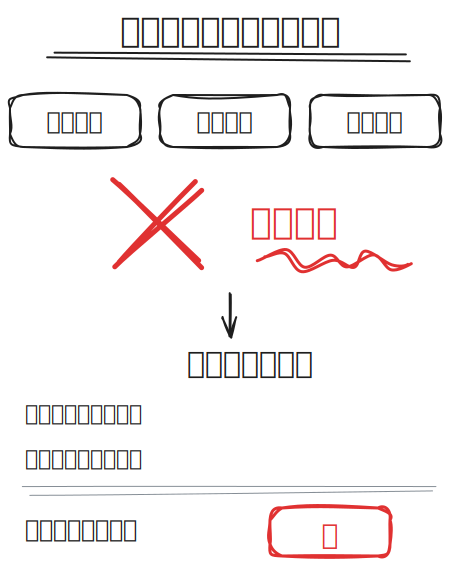
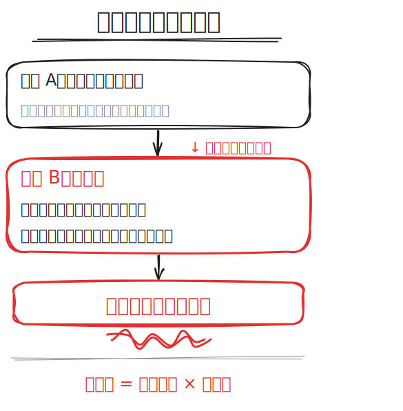
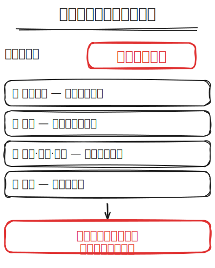

# excalidraw-whiteboard

强哥的 Excalidraw 白板幻灯片工具集。手写 Excalifont 字体、黑白红三色、3:4 竖版、教学白板风。

适合用于知识口播视频配图、录屏展示、小红书/抖音内容素材。

## 长什么样？

| 推翻旧认知 | 临界点 | 沉没成本 |
|-----------|--------|---------|
|  |  |  |

> 尺寸：每张 **500×667px（3:4 竖版）**，适配手机画幅录屏展示。
> 多张幻灯片可合并为纵向白板，滚动浏览。

## 使用方式

**获取到 `.excalidraw` 文件后：**

1. 打开 [excalidraw.com](https://excalidraw.com) 或 [xdraw.app](https://xdraw.app)
2. 点击 **Open → 选择文件**
3. 所有文字、框、箭头可随意拖拽修改
4. 改完后 Export → Image 导出 PNG/SVG

> 支持**二次编辑**。你可以随时打开文件调整文字、移动布局、修改颜色，全部保留可编辑状态。

## 安装

```bash
npx skills add zhangxiaoqiang1991/excalidraw-whiteboard
```

## 技能包

| Skill | 说明 |
|-------|------|
| `huashu-whiteboard-slides` | 强哥风格的白板幻灯片生成器 — 将脚本/大纲转化为 Excalidraw 白板图 |

## 使用方法

在 Claude Code 中调用 Skill：

> 用 huashu-whiteboard-slides 帮我做一套白板幻灯片
> 脚本是：[粘贴你的脚本]

或者直接说：

> 帮我写一条获客视频脚本，然后用白板幻灯片做出来

## 设计风格

- **字体**: Excalifont (fontFamily: 5) — 手写质感
- **配色**: 黑白红三色（正文 `#1e1e1e` / 强调 `#e03131` / 辅助 `#868e96`）
- **填充**: 所有矩形背景透明，无色块填充
- **手感**: roughness: 2-3，手绘粗糙感
- **比例**: 3:4 竖版，适配手机画幅
- **布局**: 标题居中 + 下划线，正文左对齐，宽松行距

## 尺寸建议

| 场景 | 推荐尺寸 | 说明 |
|------|---------|------|
| 单张幻灯片 | 500 × 667px | 3:4 竖版，一句一页 |
| 合并白板 | 500 × (n × 640)px | n 为页数，录屏时纵向滚动 |
| 视频配图 | 500 × 667px | 直接截图或导出 PNG |
| 小红书 | 500 × 667px | 适配竖版图文 |

## 打开方式

`.excalidraw` 文件可以用以下方式打开：

| 方式 | 链接 | 说明 |
|------|------|------|
| **Excalidraw** | [excalidraw.com](https://excalidraw.com) | 官方白板工具，免费，无需注册 |
| **XDraw** | [xdraw.app](https://xdraw.app) | 中文界面，体验更顺畅 |
| **VS Code 插件** | 插件市场搜 `excalidraw` | 开发者友好，可在编辑器内编辑 |

## 依赖

- curl（Kroki 导出用，macOS/Linux 预装）
- 或 excalidraw.com（手动打开编辑）

## 许可证

MIT
